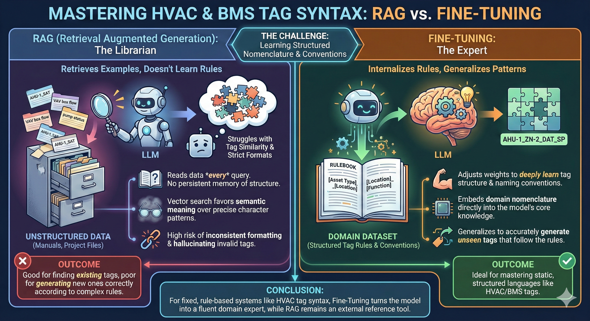
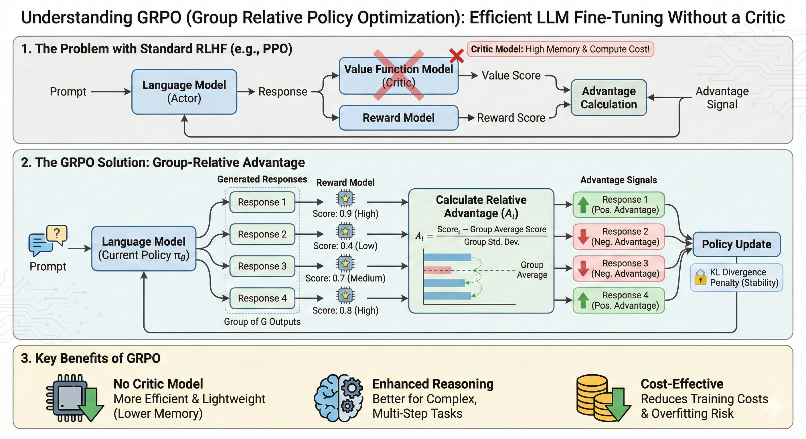

## The three-letter problem

After supervised fine-tuning, our Phi-4 model could recite every tag in our naming table. Ask it the canonical question, *"what is the tag for the supply air static pressure setpoint?"*, and it would answer correctly. Ask it the *inverse*, *"give me the supply air static pressure setpoint"* without the word "tag", and it would confidently emit:

> **`SupplyAirStaticPressureSetpoint`**

A perfectly reasonable BACnet-style name. Discoverable, self-documenting, and completely absent from our system. The correct answer was three letters: **`SPS`**.

This post is about how I closed that gap with roughly 250 lines of reward function and a quarter-epoch of GRPO, and what the experience taught me about RL on language models that I had not gotten from reading papers about it.

## The setting

I work on an internal AI assistant for an industrial domain that has its own naming taxonomy. The tags are short and opinionated, and they look nothing like the open-source conventions an LLM has seen during pretraining. Think `SPS`, `DAT`, `ZN-2_RHC` instead of the verbose, hierarchical strings that public BMS tutorials and BACnet documentation are full of.

The first instinct is RAG: index the table, retrieve the right row at query time. We tried it. It works for *direct lookup* (tag to description) and breaks for almost everything else: paraphrases, partial matches, descriptions that do not quote the table verbatim, anything that requires the model to *reason* about the structure of the names rather than recall a row.

The choice was straightforward. Teach the model the vocabulary directly. SFT got us most of the way; it did not get us all the way, and the gap was instructive.

## What SFT got right, and what it didn't

SFT (QLoRA on Phi-4, ~3 epochs over ~5k synthetic examples covering 7 scenario types) gave us a model that could:

- Recall the table verbatim when asked directly.
- Answer multiple-choice distractor questions with the right tag.
- Tolerate moderate paraphrasing in the *direct* direction (description provided, tag returned).

It still failed at:

- **Reverse lookup.** Given a description without the cue word "tag", it would invent a plausible BACnet-style name instead of using ours.
- **Refusing the unknown.** Asked about equipment that was not in the taxonomy, it would confidently produce *something*, usually a tag from a related family, rather than acknowledging it did not know. Phi-4 SFT alone scored **60% on `unknown_tag` refusal**; SFT+GRPO took it to **86.7%**.
- **Generic-naming drift.** Given a typo or an ambiguous phrasing, it would back off to the verbose, English-sounding form it had seen during pretraining. SFT scored 40% on `typo_robustness`; SFT+GRPO took it to **60%**.

These are not accuracy failures you fix with more SFT data. They are *preference* failures: the model's distribution over plausible answers is wrong in a way that more cross-entropy loss does not address. Cross-entropy rewards being close to the target token. It does not punish a confident, fluent answer that happens to be drawn from the wrong vocabulary.

That is what RL is for.

## Why GRPO, not PPO

I went with GRPO over PPO for the standard reason (no critic) and one less-standard reason that mattered more in practice. GRPO's group-relative advantage gave me a much cleaner signal for reward shaping. Every prompt produces a small group of completions; advantages are normalised within the group. That means the absolute scale of the reward function matters less than the *ordering* it induces, which is exactly what I wanted when iterating on reward design.

## Designing a reward function that punishes the right things

This is the section that matters. Most public GRPO write-ups use a one-line reward, a correctness flag or a regex match. Mine is ~250 lines and has *seven* scenarios with calibrated reward bands, because the failures I was trying to fix were qualitatively different from each other and a scalar correctness signal could not distinguish them.

The reward bands, abbreviated:

| Scenario | Correct | Wrong | Why this shape |
|---|---|---|---|
| Reverse lookup (description to tag) | **+1.0** | **-0.8** | High-stakes, asymmetric. A wrong tag here is the failure mode I was trying to fix. |
| Direct lookup (tag to description) | +0.7 / +0.3 (partial) | -0.5 | SFT was already good here. Light reinforcement only. |
| Context reasoning (physical vs. virtual) | +0.6 + bonus | -0.4 | Reward correct *reasoning keywords*, not just final answer. |
| Unknown-tag refusal | **+1.0** | **-1.0** (trap) | Confidently naming a real tag when asked about something out-of-table is the *worst* failure. The asymmetric trap forces the model to learn "I don't know" as a high-reward action. |
| Typo robustness | +1.2 (recover) | -0.5 | Edit-distance-based intended-tag recovery. Reward *correcting*, not refusing. |
| Hedging penalty | n/a | -0.2 | "I think it might be..." is worse than a confident wrong answer here, because hedging is what masked the failure during SFT eval. |
| Format / concision bonus | +0.1 each | n/a | Short, well-formatted answers preferred. |

A few specific reward-design decisions I'd defend:

**The `unknown_tag` trap (+1.0 vs -1.0) is the single most important band.** It is what taught the model that "I don't know" is an answer. Without the asymmetric penalty, the model would fall back to a related-family tag: fluent, plausible, wrong. With it, refusal becomes the high-reward action and the model stops gambling.

**The `reverse_lookup` penalty is asymmetric (-0.8 against +1.0)** because the failure mode it targets, inventing a BACnet-style name, is a *fluent, confident* failure that an SFT eval set will under-measure. Symmetric rewards would let the model trade off these failures against easy wins on direct lookup. Asymmetric rewards make that trade unprofitable.

**The hedging penalty is small (-0.2) and intentional.** It is not punishing the model for being uncertain; it is punishing it for *expressing* uncertainty in cases where the answer is recoverable. The right move on a typo is to recover and answer, not to hedge.

## Conservative GRPO: refinement, not relearning

Most failure stories I have read with GRPO come from the same place. Too much learning rate, too little KL anchor, too many epochs, and the model drifts off the SFT distribution into a degenerate reward-hacking mode that scores well on the reward function and is useless in production.

My hyperparameters were deliberately conservative:

| Param | Value | Rationale |
|---|---|---|
| LoRA `r` | 4 | Tiny adapter. Refine, do not relearn. |
| LoRA `α` | 8 | 2× `r`, conventional. |
| Learning rate | 5e-7 | An order of magnitude below typical SFT. |
| KL `β` | **0.2** | Strong anchor to the SFT distribution. |
| Epochs | **0.25** | Stop *before* drift sets in. |
| Group size `G` | 4 | Smallest group that gives a meaningful relative advantage. |

The thesis: *SFT already knows the tags. GRPO's job is to reshape the model's preferences over how to use them, not to teach it new ones.* That framing, RLHF as preference reshaping with a hard KL leash, is consistent with what the InstructGPT and Anthropic HH-RLHF papers describe in their own runs, and it is what the production behaviour confirmed. The model did not get smarter; it got *opinionated* in the right direction.

## When the residual failures wouldn't budge: targeted DPO

GRPO closed most of the gap. One residual failure remained: on a specific subclass of reverse-lookup queries (those that paraphrased a description in a way that overlapped lexically with public BACnet conventions), the model would still occasionally drift to the verbose form. The reward function could not distinguish those queries cleanly enough at the group level.

So I switched tools. I generated targeted preference pairs (correct tag preferred over the BACnet-style hallucination), oversampled the failing subclass with `reverse_weight=3`, and ran DPO on top of the GRPO checkpoint. The pattern, *use GRPO for broad behavioural shaping, use DPO for surgical fixes on residual failures*, felt right and is something I would reach for again.

That story deserves its own post. For here, it is enough to say that the combination held the SFT+GRPO gains while quietly closing more residual cases.

## Results

I evaluated seven model variants. Base SFT, SFT+GRPO, and SFT+DPO across two open-weights families (Phi-4 14B, Mistral 7B), plus a Phi-4-only GRPO baseline (no SFT first), plus a closed-source comparator (GPT-4.1-mini fine-tuned via Azure on the same data). All numbers below are from the same held-out eval, all scored against the same scenario harness. Models ran as quantized GGUF for inference parity.

![Overall accuracy across the seven model variants on the held-out eval. **Phi-4 SFT+GRPO leads at 83.3%**, with SFT+DPO close behind at 82.2%. The 15.5-point lift over Phi-4 SFT alone (67.8%) is the headline. Phi-4 GRPO without SFT first (58.9%) underperforms even SFT alone, confirming the conservative "refine, do not relearn" thesis. The Azure-fine-tuned GPT-4.1-mini at 20% is a useful sanity check: a generic fine-tuning API on a stronger base model loses badly to a thoughtfully post-trained 14B open model on this task.](overall_accuracy.png)

The per-scenario breakdown is where the reward design earns its keep:

![Per-scenario accuracy. The two scenarios that GRPO and DPO target most directly, `unknown_tag` refusal and `typo_robustness`, are exactly where the largest lifts show up. SFT alone hits 60% on `unknown_tag`; SFT+GRPO and SFT+DPO hit 86.7% and 86.7% respectively. On `typo_robustness`, SFT's 40% becomes 60% with GRPO. The "easy" scenarios (direct lookup, multiple choice, physical/virtual classification) saturate near 100% across most variants, which is the point: the asymmetric reward bands deliberately spent learning capacity on the hard scenarios without trading away the easy ones.](accuracy_by_scenario.png)

A few specific things I'd call out from these numbers:

- **The `unknown_tag` lift is the most important result in the post.** It is the failure mode the asymmetric trap (+1.0 / -1.0) was designed for, and the +26.7-point delta on Phi-4 is the cleanest evidence that the reward shaping worked as intended rather than as a happy accident.
- **Phi-4 GRPO without SFT (58.9%) underperforms Phi-4 SFT alone (67.8%).** Same model, same data, same RL recipe, minus the SFT warm-start. RL on language models without a strong supervised initialisation is a different (and harder) problem; this row is the empirical version of "SFT first, then RL" as a recipe rather than a slogan.
- **GPT-4.1-mini via Azure fine-tuning at 20%** is the comparator that surprised me most. The fine-tuning API does not expose enough of the loss function to express the asymmetric preferences this task needs; a more capable base model with a less expressive post-training surface loses to a smaller open model with a more expressive one. *Reward design is the work* is not just a slogan I picked for the section heading.

One qualitative example to ground the table:

> **Prompt:** *"give me the supply air static pressure setpoint"*
> **Phi-4 SFT:** `SupplyAirStaticPressureSetpoint`
> **Phi-4 SFT+GRPO:** `SPS`
> **Ground truth:** `SPS`

The post is built around that one example because every story I have about this project bottoms out in some version of it. A fluent, plausible, confident answer, drawn from the wrong vocabulary, that no SFT eval set was going to flag.

## A small detail that signals "this shipped"

One implementation note that did not make the narrative but that I would put in a sidebar: TRL's `GRPOConfig` and `GRPOTrainer` APIs have churned across versions (`max_new_tokens` vs `max_completion_length`, `processing_class` vs `tokenizer`, `reward_funcs` vs `reward_function`). My `_build_grpo_config()` introspects `GRPOConfig.__init__` at runtime and picks the right kwargs for the installed version. It is three small `inspect.signature` checks. It saved me twice across upgrades and is the kind of thing you only write after you have shipped something for real.

## What I'd do next

- **Step-DPO** for the multi-step reasoning scenarios (physical vs. virtual classification), where the failure is in the chain, not the answer.
- **An RLAIF critic** trained on a held-out slice of the taxonomy, to remove the manual-reward-tuning bottleneck for new scenarios.
- **Reward-model regularisation.** Measuring how much of the post-GRPO behaviour is reward-hacking the specific bands vs. genuine preference shift. The Anthropic Constitutional AI paper's diagnostic ideas would translate cleanly here.

## What this taught me

A few things I did not get from reading RLHF papers and only got from running this:

1. **Reward design is the work.** The training loop is mechanical; the reward function is where the research is. Every hour I spent on hyperparameters returned less than every hour I spent on the asymmetric reward bands.
2. **KL is not a tuning knob, it is a leash.** Keeping `β` high and learning rate low felt unambitious until I tried lowering them, watched the model drift into reward-hacking, and put them back.
3. **The model already knows.** SFT had the information. GRPO did not add knowledge; it changed which knowledge the model preferred to use. That distinction, between teaching and reshaping, is most of what makes RLHF feel different from SFT in practice.

---

*The codebase that backs this post lives in a private repo; a sanitized public version is in progress. If you're working on similar problems, domain taxonomies, post-training for vocabulary control, asymmetric reward design, I'd love to compare notes.*
