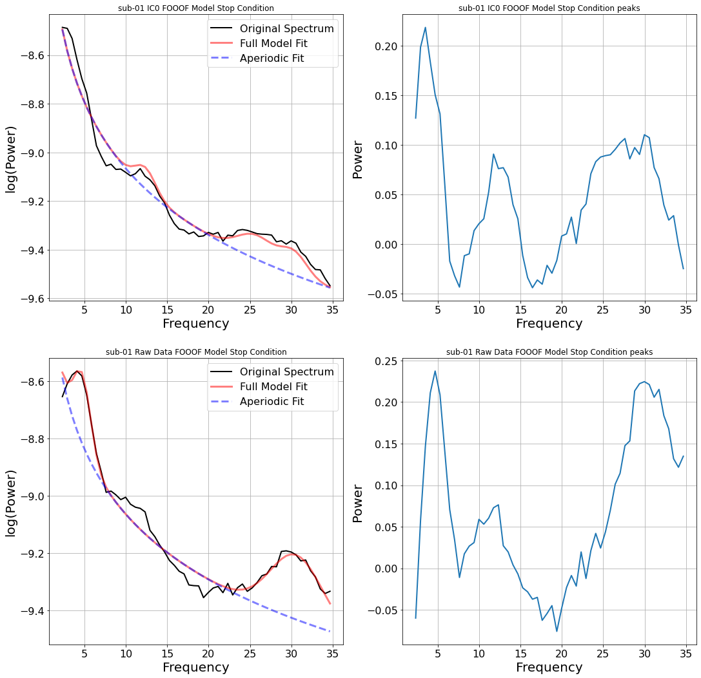

## A filter fit to the patient is a biomarker of the patient

The conventional view of EEG preprocessing treats spatial and spectral filters as a kind of janitorial work. Clean the data, then do the science on whatever's left. My graduate research convinced me of the inverse: the filter parameters *are* the science. They quotient out the structure that varies idiosyncratically across people, and the parameters they learn while doing it carry the individual's signature. The features that remain are comparable across people only because the filter has eaten the variance that wasn't.

This post is about three filters I worked with, what each one removes, what its parameters reveal, and why the same intuition shows up every time I read a mechanistic interpretability paper.

## The setting

The thesis platform was a saccade-based stop-signal task in VR with simultaneous 32-channel scalp EEG, on seven healthy subjects, designed as the pilot validation for a Parkinson's disease biomarker study. Subjects fixated on a central point, were cued to prepare a prosaccade or antisaccade, and on 20% of trials had to *cancel* the planned movement when the fixation point turned green. The neural signature of successful cancellation, frontal theta synchronisation followed by motor beta desynchronisation, is well-described in the reach literature; the question was whether a robust classifier could detect that signature on a per-subject basis with a small amount of data.

Off-the-shelf decoders generalise poorly here, and not for the reason most ML readers expect. The problem isn't sample size or label noise. It's that the relevant frequency band is genuinely different in different brains. Subject 1's task-modulating beta peak sits at 29–32 Hz. Subject 2's sits at 15–20 Hz. Subject 4's is 13–19 Hz. If your classifier filters the signal at 13–30 Hz "because that's beta", you are doing two completely different operations on those subjects and pretending it's the same one.

The same problem shows up in a much harsher form in the parallel work I did on intraoperative microelectrode recordings from deep brain structures. Different patient, different anatomy, different background spectra, and you only get the recording window the surgeon gives you. There's no luxury of a population-fit pipeline; the filter has to work *on this person, today*.

## Three filters, three levels of structure removed

### ICA: remove statistical mixtures

Independent Component Analysis assumes the recorded channels are linear mixtures of statistically independent sources, $X = AS$, and estimates the de-mixing matrix $W$ such that $U = WX$ recovers components that are as independent as possible. In EEG this works because ocular, muscle, and cardiac artifacts genuinely *are* statistically independent of cortical activity at the scales we care about, and they have stereotyped topologies (frontal-symmetric for blinks, lateral for muscle).

The thesis-relevant property of ICA is that it's *unsupervised*. There's no experimenter bias in choosing what's "signal". You decompose, you look at the topologies, and you keep the component whose ERP and scalp distribution match what neurophysiology says response inhibition should look like. The component is not "the signal"; the component is *a basis vector* in a decomposition the data itself proposed.

### FOOOF: remove the aperiodic background

The brain's resting power spectrum is dominated by an aperiodic 1/f component on top of which narrow oscillatory peaks live. FOOOF (*Fitting Oscillations and One Over F*, Donoghue et al.) fits the aperiodic background as a linear function in log-log space, subtracts it, and parameterises whatever peaks remain by their centre frequency, bandwidth, and amplitude.

The number that mattered for the thesis is in this table:

| Subject | α range (Hz) | β range (Hz) |
|---:|---:|---:|
| 1 | 11–13 | **29–32** |
| 2 | 9–13 | **15–20** |
| 3 | none | **28–32** |
| 4 | 7–10 | **13–19** |
| 5 | 5–9 | **23–28** |
| 6 | 7–13 | **17–24** |
| 7 | 8–12 | **20–25** |

Seven subjects, seven different β bands. "13–30 Hz beta" is not one phenomenon; it's a population-level smear that hides the structure. Worse, in some subjects the narrow peak is only detectable *after* ICA has stripped out an artifact component that was dragging power into a different region of the spectrum. The peaks live in a basis the raw signal doesn't expose.

### CSP: remove between-class variance you don't care about

Common Spatial Patterns finds spatial filters that maximise variance for one class while minimising it for the other. Given band-passed EEG matrices $X_H$ and $X_F$ for two classes, CSP solves a generalised eigenvalue problem on their normalised covariances, and the resulting filters project the data into a subspace where the two classes are maximally separable in variance.

Two things matter here. First, CSP is parameterised by the band-pass it operates in, and that's where the FOOOF output enters. Feeding CSP the subject-specific narrow band, instead of the conventional 13–30 Hz, lets it find spatial filters that actually correspond to task-relevant activity rather than whatever broad-band variance happens to dominate. Second, the resulting topologies become a *check on the rest of the pipeline*. A CSP filter that places its weight at the temples is using muscle, not cortex. A filter that places it centrally over sensorimotor cortex is doing what we wanted.

## The reframe: filter parameters are features

Notice the move that's happening across all three stages. ICA gives you a mixing matrix $A$ that's specific to this subject's recording; the columns of $A$ are this person's source topologies. FOOOF gives you a triple $(f_c, \text{bw}, a)$ that's specific to this subject's resting spectrum. CSP gives you spatial filter weights conditioned on this subject's data and frequency band.

The conventional pipeline treats these as preprocessing artefacts, things you need to fit but can throw away once you have the post-filter signal. The reframe: the parameters *are* the features you actually want. They encode the individual in a low-dimensional, interpretable way. The post-filter signals become comparable across people exactly because the parameters have absorbed whatever was idiosyncratic.

This is the same intuition as **whitening followed by per-instance layer-norm in a transformer**: a per-sample reparameterisation that makes the rest of the pipeline well-conditioned, without which the downstream layers are doing different operations on different inputs and pretending it's the same operation. The whitening matrix is sample-specific; the post-whitened space is shared.

## The empirical payoff

Across the seven subjects, classifying Go versus successful Stop trials with a Random Forest over CSP features showed a consistent pattern: **using subject-specific β bands from FOOOF, instead of the conventional 13–30 Hz broad band, lifted stop-trial recall by an average of ~10 percentage points and up to +13.8 points** (subject 01). The lift is largest where it should be: subjects whose narrow β is far from the centre of the broad band gain the most, because for them the broad-band filter is paying for off-band noise.

This isn't a story about elegance. It's about whether the classifier is learning anything useful at all. When the filter band is wrong, the post-CSP features mix task signal with off-band drift, and the classifier ends up modelling whichever happens to dominate on the training day. When the filter band is right, the features become comparable across subjects, and a small amount of per-subject calibration generalises to held-out sessions. The thesis showed exactly that: decoding performance *improved* across successive recording sessions on the same subject when the per-subject features were used, where a generic pipeline would degrade as the resting state drifted.

## The bridge to mechanistic interpretability

Modern transformers don't have a 1/f spectrum to subtract, and they don't have ICA-style independent sources to recover linearly. The math is genuinely different. The *question*, though, is the same: where in this signal does the structure live, and what filter recovers it?

Sparse autoencoders for mechanistic interpretability are doing roughly this. The MLP activation at a transformer layer is a dense, polysemantic mixture; an SAE finds an overcomplete sparse basis where individual directions correspond to interpretable features. The SAE *parameters* (the dictionary) are model-specific in the same way ICA's mixing matrix was subject-specific. The post-decomposition features become legible exactly because the dictionary has absorbed the polysemantic structure.

The framing I find most useful is the one I left graduate school with:

- **ICA is the linear, statistically-independent ancestor of the SAE.** Both find a basis for a noisy mixture in which the components are individually meaningful.
- **FOOOF is a domain-specific structural prior.** It says "we know there's a 1/f component, fit it explicitly, model the residual." The transformer analogue is recent work that explicitly subtracts low-rank "background" structure from activations before looking for sparse features.
- **CSP is task-conditioned dimensionality reduction.** It's most analogous to probing classifiers: find a subspace where the labels are linearly separable, and inspect what the subspace responds to.

None of these are perfect analogies. The relevant signal in a transformer isn't the brain's, and the failure modes of spectral filtering don't translate directly to representation learning. But the *willingness to treat the individual sample as the unit of investigation*, rather than averaging straight to a population estimator, is a habit of mind that travels.

## What this taught me

A few things I took out of this work that still shape how I think about modern ML:

1. **Per-sample parameters are not overhead; they're often the answer.** The reflex to "throw away the calibration" is wrong when the calibration is what makes the rest of the pipeline well-conditioned.
2. **Decomposition before classification.** When the input is mixed, fit a decomposition and let the classifier work in the unmixed basis. This is true for EEG, true for vision-language fusion, and increasingly true for transformer interpretability.
3. **Trust the topology more than the accuracy.** A model that achieves high accuracy by attending to artifact channels is failing in a way the validation set won't tell you about. CSP scalp topologies are the cheapest sanity check I've ever shipped, and the equivalent in modern ML, looking at *which features the model is actually using*, is one of the few things I expect to keep doing for the next decade.

---

*The full thesis is open-access at the [University of Ottawa repository](https://ruor.uottawa.ca/items/9d22c2da-12c4-432a-87f6-6ae6c4d11f4f) for anyone who wants the complete methods or the per-subject figures. If you're working on per-instance reparameterisation in language models, or on bridges between classical signal-decomposition and modern interpretability, I'd love to compare notes.*
